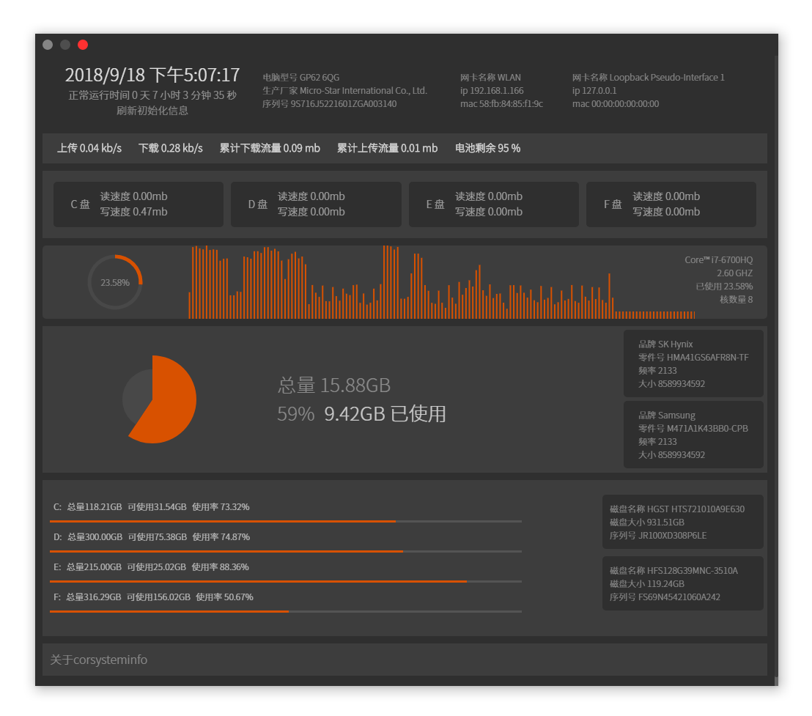

# corsysteminfo
corsysteminfo是一个实时监测系统的软件，使用该软件可能需要占用10%的cpu和200~300m的内存。


目前根据systeminformation库显示了以下信息

1-时间

2-运行时间

3-电脑型号

4-生产厂家

5-序列号

6-ip (点击复制到粘贴板)

7- mac地址 (点击复制到粘贴板)

8-上传速度

9-下载速度

10-从打开程序开始 累计上传流量 (关闭时候清空)

11-从打开程序开始 累计下载流量 (关闭时候清空)

12- 电池剩余电量

13- 硬盘读写速度 (使用vbs实现,原因是Wmic没有提供命令,systeminformation获取window信息是通过Wmic获取的)

14- 获取cpu名称、GHZ、使用率、核数量

15- 显示总内存、内存使用率、使用量

16- 内存硬件信息

17- 分区 总量以及使用率、可使用大小

18- 硬盘硬件信息


目前仅提供window版本的包


#### Build Setup

``` bash
# install dependencies
yarn

# serve with hot reload at localhost:9080
yarn dev

# build electron application for production
yarn build


```

---

This project was generated with [electron-vue](https://github.com/SimulatedGREG/electron-vue) using [vue-cli](https://github.com/vuejs/vue-cli). Documentation about the original structure can be found [here](https://simulatedgreg.gitbooks.io/electron-vue/content/index.html).
